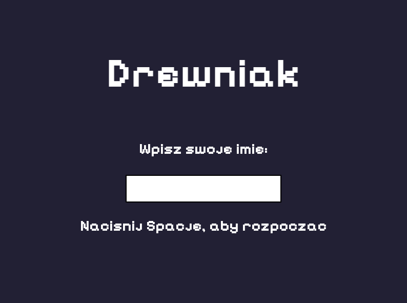
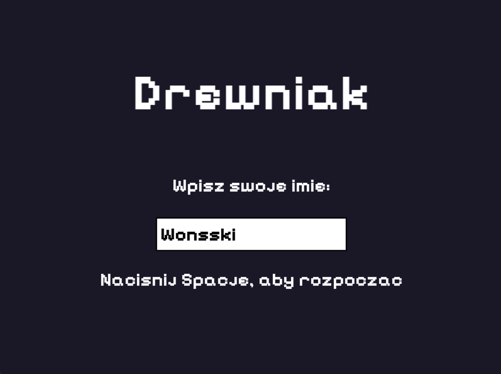
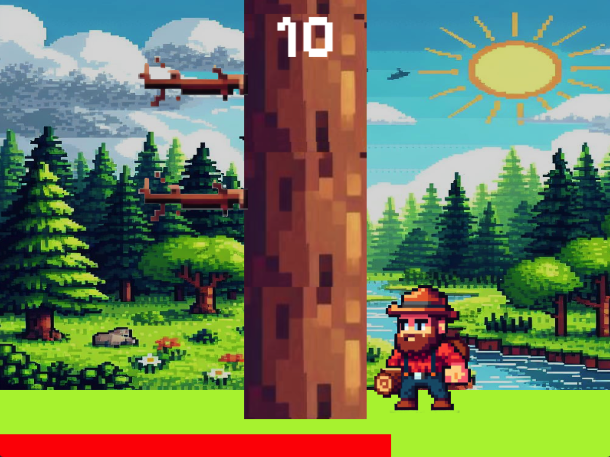
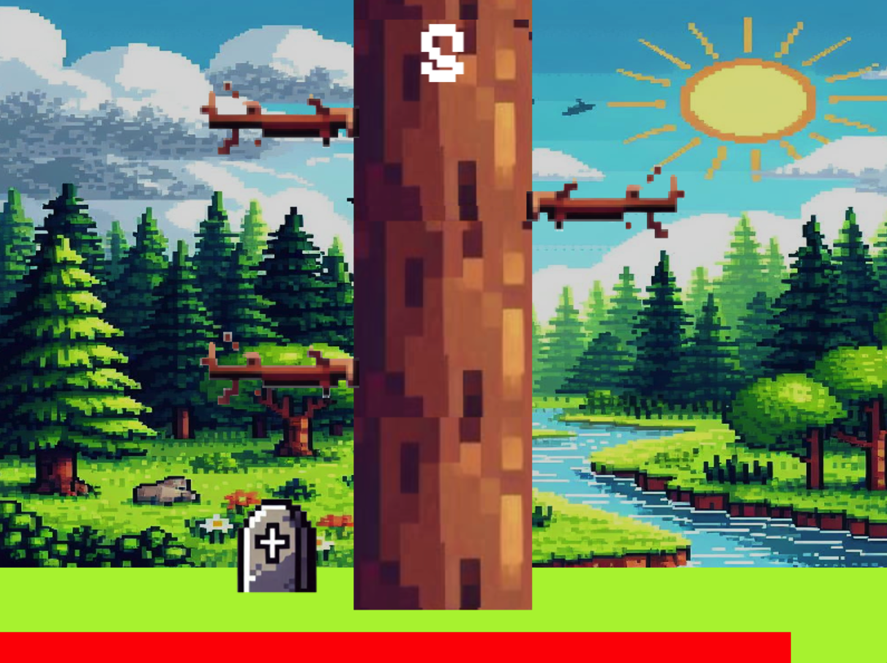
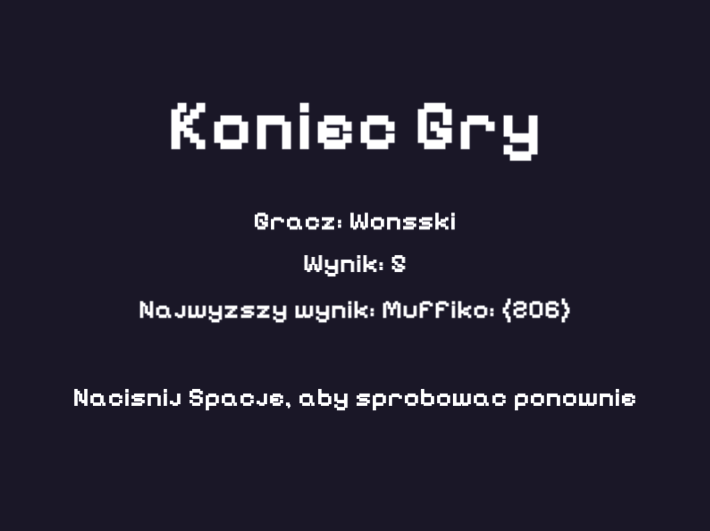

# Timberman type Game Project - Drewniak

## Author: Radosław 'Wonsski' Rajda
**Date:** June, 2024  

## Project Overview
This project involved the development of a Timberman-style arcade game where the player controls a lumberjack cutting down a tree while avoiding falling branches. The goal is to chop the tree as much as possible without colliding with any branches.

## Analysis

### Objective
The aim was to create a simple yet engaging game, focusing on player interaction and response time.

### Key Design Choices
- **Classes:**
  - **`Game`:** Manages the overall game logic and user interactions.
  - **`Player`:** Represents the player, including state and movement.
  - **`Tree`:** Represents the tree, generating obstacles as branches.
  - **`Branch`:** Represents individual branches that act as obstacles.

- **Libraries:**
  - **SFML:** Used for handling graphics, user input, and game mechanics.

## User Instructions

### How to Play
1. **Start the Game:** Upon launching, the start screen appears, asking for the player's name. Press `Space` to proceed.
2. **Gameplay:** Use the left and right arrow keys to move the player and avoid obstacles. Press `Space` to chop the tree, lowering obstacles by one level and resetting the game timer.
3. **Objective:** Continue chopping as much as possible. The time allowed for decision-making decreases as the game progresses.
4. **End of Game:** The game ends if the player hits a branch or the time runs out.

### After the Game
- **End Screen:** Displays the player's name and score.
- **High Score:** The game saves the player's score locally and displays the current leader's name and score at the center of the screen.
- **Restart:** Press `Space` to restart the game, with a flashing message indicating the option to play again.

## Internal Specifications

### Classes and Their Roles
- **`Game`:** Core of the game, managing the flow and interactions.
- **`Player`:** Manages player movements and interactions with obstacles.
- **`Tree`:** Handles obstacle generation and updates.
- **`Branch`:** Defines the characteristics and behavior of obstacles.

## Conclusion
The Timberman game project successfully delivered a well-designed and thoroughly tested game. The user interface is intuitive, and gameplay is fluid and engaging. While the core mechanics are solid, the addition of animations could enhance the overall experience by adding more dynamic elements to the game. This would make the game even more visually appealing and enjoyable for players.

## User Interface

 

 

 

